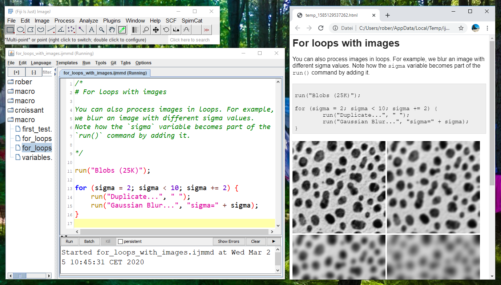
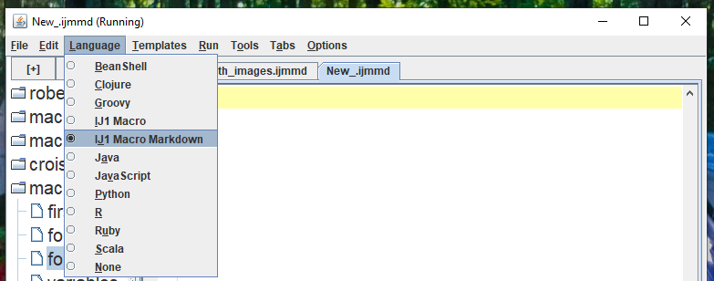

# ImageJ Macro Markdown

ImageJ Macro MarkDown (IJMMD) is a [Fiji](https://fiji.sc) plugin combining the benefits of the 
[ImageJ Macro language](https://imagej.nih.gov/ij/developer/macro/macros.html)
with
[Markdown](https://en.wikipedia.org/wiki/Markdown).



It is thought for ease of generating tutorials for the ImageJ macro language.
The plugin is in an early development stage.
[Feedback](https://forum.image.sc/t/imagej-macro-markdown/35470) is very welcome. 

## Installation
* Download and install [Fiji](https://fiji.sc/Downloads)
* Download the [imagejmacromarkdown_.jar](https://github.com/haesleinhuepf/imagejmacromarkdown/releases/download/0.2.0/imagejmacromarkdown_-0.2.0.jar) and 
[commonmark-0.14.0.jar](https://repo1.maven.org/maven2/com/atlassian/commonmark/commonmark/0.14.0/commonmark-0.14.0.jar) and
put them in the `jars` directory of your Fiji installation.
* Restart Fiji.

## Examples
Idea of IJMMD is that you can use markdown style text formatting
in multi-line comments:
 
```
/*
# Headline
Here comes some markdown text
*/
print("Here comes ImageJ macro code");
``` 

Thus, .ijmmd files can be executed with the normal Fiji script editior. By switching
the scripting language to `ImageJ Macro Markdown`, markdown.md and html files are
generated when running the script.



More examples can be found in the [macro folder](https://github.com/haesleinhuepf/imagejmacromarkdown/tree/master/src/main/macro).

Happy coding.

Cheers,
Robert [@haesleinhuepf](https://twitter.com/haesleinhuepf) Haase
